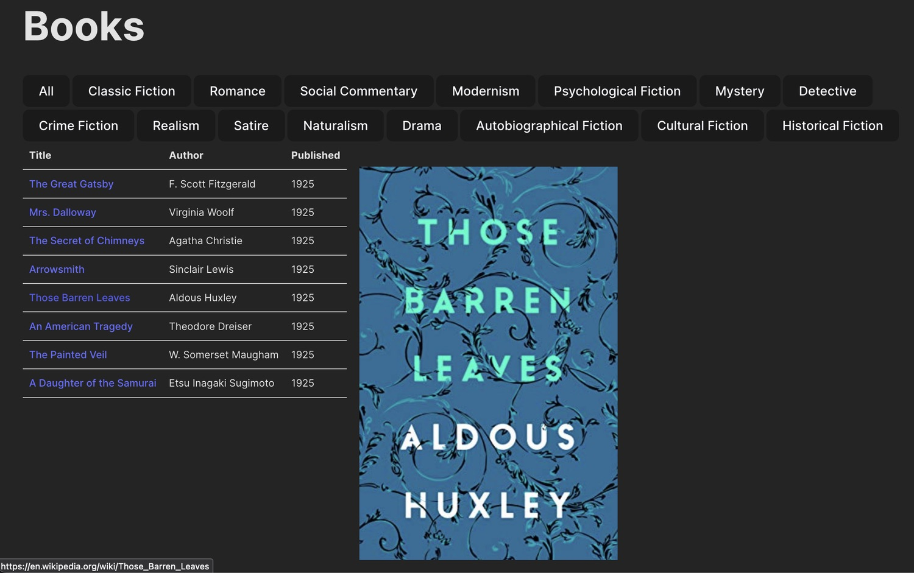

# Book Base: Collection Viewer built in Svelte

This is a collection viewer built in Svelte. It loads a CSV file and makes a little website out of it.



## Video

Watch the video to see how we built this:

[](https://www.youtube.com/watch?v=5zb7-3ccG_k)

## Requirements

Make sure you have [Node.js](https://nodejs.org/en) installed. In the terminal, run:

```bash
npm install
npm run dev
```

## Recommended IDE Setup

Install

[VS Code](https://code.visualstudio.com/) + [Svelte](https://marketplace.visualstudio.com/items?itemName=svelte.svelte-vscode).

## Deploying

To deploy, run `npm run build`. This will create a `dist` directory with your built app. You can deploy that to any static hosting provider. We also provided a configuration file for [Netlify](https://www.netlify.com/), a popular static hosting provider.
